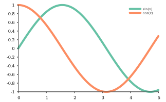

<p align="center">
    
</p>

# Overview

**So, you have an amazing C++ application for which you need plotting capabilities.** You have searched around and discovered that the available options for C++ plotting libraries is rather limited compared to other programming languages, such as Python, for example, which has [matplotlib].

The goal of the **sciplot project** is to enable you, C++ programmer, to **conveniently plot beautiful graphs** as easy as in other high-level programming languages. **sciplot** is a header-only library that needs a C++14-capable compiler, but has no external dependencies for compiling. The only external runtime dependencies are [gnuplot-palettes] for providing color palettes and a [gnuplot] executable.

Here is an example of **sciplot** in action:

```c++
#include <sciplot/sciplot.hpp>
using namespace sciplot;

int main(int argc, char** argv)
{
    // Create values for your x-axis
    const vec x = linspace(0.0, 5.0, 100);

    // Create a Figure object
    Figure fig;

    // Set color palette
    fig.palette("set2");

    // Draw a sine graph putting x on the x-axis and sin(x) on the y-axis
    fig.drawCurve(x, std::sin(x)).label("sin(x)").lineWidth(4);

    // Draw a cosine graph putting x on the x-axis and cos(x) on the y-axis
    fig.drawCurve(x, std::cos(x)).label("cos(x)").lineWidth(4);

    // Show the figure in a popup window
    fig.show();

    // Save the figure to a PDF file
    fig.save("example-trigonometric-functions.pdf");
}
```

After compiling and executing this C++ application, the following figure should be produced:

<p align="center">
    
</p>

Do you want to change the colors? Simple - just use the `Figure::palette` method to set your preferred color palette. For example, `Figure::palette("parula")` sets the [parula](https://www.mathworks.com/help/matlab/ref/parula.html) color scheme. All available color palettes and their names can be found [here][gnuplot-palettes]. Many thanks to [Anna Schneider][AnnaSchneider] for this incredible work of art!

For more examples, see the [examples](./examples) directory. If you need information about specific gnuplot functions, see the gnuplot [documentation](http://www.gnuplot.info/documentation.html).

# sciplot and gnuplot

All plotting capabilities of **sciplot** are powered by [gnuplot].  Your plotting code, using a modern and elegant C++ API provided by **sciplot**, is converted to a gnuplot script, which is then executed to generate the desired figure. Note that gnuplot 4.2+ is needed for multiplots.

[gnuplot]: http://gnuplot.info/
[gnuplot-palettes]: https://github.com/sciplot/gnuplot-palettes
[matplotlib]: https://matplotlib.org/
[AnnaSchneider]: https://github.com/aschn
