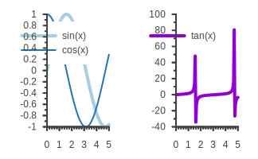

# {: loading=lazy; width=100% }

<!-- # Warning -->

# **! WARNING !** sciplot has been redesigned and there were breaking API changes between v0.2 and v0.3. See the [tutorials](https://sciplot.github.io/tutorials/) and the [API documentation](https://sciplot.github.io/api/) for the new version.

<!-- # Overview -->

**So, you have an amazing C++ application for which you need plotting capabilities.** You have searched around and discovered that the available options for C++ plotting libraries is rather limited compared to other programming languages, such as Python, for example, which has [matplotlib](https://matplotlib.org/).

The goal of the **sciplot project** is to enable you, C++ programmer, to **conveniently plot beautiful graphs** as easy as in other high-level programming languages. **sciplot** is a header-only library that needs a C++17-capable compiler, but has no external dependencies for compiling. The only external runtime dependencies are [gnuplot-palettes] for providing color palettes and a [gnuplot] executable.

Here is {{sciplot}} in action:

```c++
#include <sciplot/sciplot.hpp>
using namespace sciplot;

int main(int argc, char** argv)
{
    // Create values for your x-axis
    Vec x = linspace(0.0, 5.0, 100);

    // Create a Plot object
    Plot2D plot1;
    // Set color palette for first Plot
    plot1.palette("paired");
    // Draw a sine graph putting x on the x-axis and sin(x) on the y-axis
    plot1.drawCurve(x, std::sin(x)).label("sin(x)").lineWidth(4);
    // Draw a cosine graph putting x on the x-axis and cos(x) on the y-axis
    plot1.drawCurve(x, std::cos(x)).label("cos(x)").lineWidth(2);

    // Create a second Plot object
    Plot2D plot2;
    // Draw a tangent graph putting x on the x-axis and tan(x) on the y-axis
    plot2.drawCurve(x, std::tan(x)).label("tan(x)").lineWidth(4);

    // Put both plots in a "figure" horizontally next to each other
    Figure figure = {{plot1, plot2}};

    // Create a canvas / drawing area to hold figure and plots
    Canvas canvas = {{figure}};
    // Set color palette for all Plots that do not have a palette set (plot2) / the default palette
    canvas.defaultPalette("set1");

    // Show the canvas in a pop-up window
    canvas.show();

    // Save the plot to a SVG file
    canvas.save("example-readme.svg");
}
```

After compiling and executing this C++ application, the following plot (`example-readme.svg`) is produced:

{: loading=lazy }

Do you want to change the colors?

Simple - just use method `Plot::palette` to set your preferred color palette. For example, using `plot.palette("parula")` in the previous code sets the [parula](https://www.mathworks.com/help/matlab/ref/parula.html) color scheme and produces the following plot:

{: loading=lazy }

All available color palettes and their names can be found [here][gnuplot-palettes]. Many thanks to [Anna Schneider][AnnaSchneider] for this incredible work of art!

[gnuplot-palettes]: https://github.com/sciplot/gnuplot-palettes
[AnnaSchneider]: https://github.com/aschn
[gnuplot]: http://gnuplot.info/
