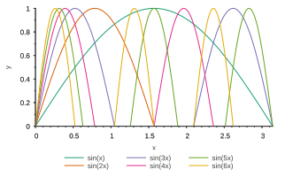
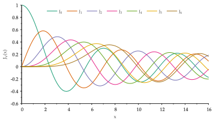
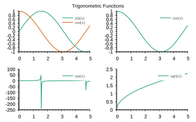
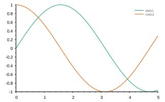
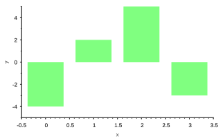
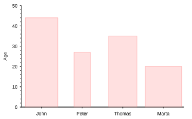

# Tutorials

Check below for a series of examples on how to use {{sciplot}}. If you like
{{sciplot}}, please consider helping with more examples!

## Plotting sine functions

{{ inputcpp('examples/example-sine-functions.cpp', startline=26) }}

{: loading=lazy }

## Plotting Bessel functions

We will skip the introduction to Bessel functions, which can be read in this
[Wikipedia article](https://en.wikipedia.org/wiki/Bessel_function) and go
straight to plotting them! This example assumes that they have already been
pre-computed and stored in `std::vector` objects (see below).

{{ inputcpp('examples/example-bessel-functions.cpp', startline=26) }}

{: loading=lazy }

## Plotting multiple plots

{{ inputcpp('examples/example-multiplot.cpp', startline=26) }}

{: loading=lazy }

## Ploting trigonometric functions

{{ inputcpp('examples/example-trigonometric-functions.cpp', startline=26) }}

{: loading=lazy }

## Plotting boxes

{{ inputcpp('examples/example-boxes.cpp', startline=26) }}

{: loading=lazy }

## Plotting boxes with custom tick labels

{{ inputcpp('examples/example-boxes-ticklabels.cpp', startline=26) }}

{: loading=lazy }

## Integration with CMake-based projects

Integrating {{sciplot}} in a CMake-based project is very simple as shown next.

Let's assume our CMake-based project consists of two files: `main.cpp` and
`CMakeLists.txt`, whose contents are shown below:

----

**main.cpp**
{{ inputcpp('examples/cmake-project/main.cpp') }}

**CMakeLists.txt**

{{ inputcode('examples/cmake-project/CMakeLists.txt', 'cmake') }}

----

In the `CMakeLists.txt` file, note the use of the command:

```cmake
find_package(sciplot)
```

to find the header files of the {{sciplot}} library, and the command:

```cmake
target_link_libraries(app sciplot::sciplot)
```
to link the executable target `app` against the {{sciplot}} library
(`sciplot::sciplot`) using CMake's modern target-based design.

To build the application, do:

```bash
mkdir build && cd build
cmake .. -DCMAKE_PREFIX_PATH=/path/to/sciplot/install/dir
make
```

!!! attention

    If {{sciplot}} has been installed system-wide, then the CMake argument
    `CMAKE_PREFIX_PATH` should not be needed. Otherwise, you will need to specify
    where {{sciplot}} is installed in your machine. For example:

    ```bash
    cmake .. -DCMAKE_PREFIX_PATH=$HOME/local
    ```

    assuming directory `$HOME/local` is where {{sciplot}} was installed to, which
    should then contain the following directory:

    ```
    $HOME/local/include/sciplot/
    ```

    where the {{sciplot}} header files are located.

To execute the application, do:

```bash
./app
```
